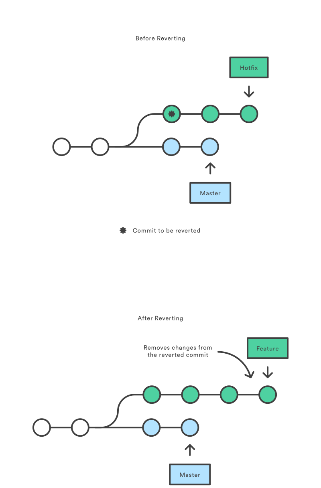

# List of Contents
- [Good commit messages](commit-messages)
- `git stash` to save local changes
- `git checkout` to jump between code versions
- `git revert` to undo a commit by creating a new commit
- Branches

# Stashing

# Checkout Old Commits
The `git checkout` command updates the state of the repository to a specific point in the projects history or change between branches.  
Before checking out you need to commit or stash all changes in the working directory.

When you returned to an older state and want to make changes you should create a new branch.

# Revert a Commit
With `git revert` you can undo the changes of a specific commit by creating a new commit on top of the branch.
```
git checkout hotfix
git revert HEAD~2
```



# Command Library

| Command | Options | Explanation
| --- | --- | --- |
| `ls` |  | Shows content of current folder |
| `cd` |  <ul style="list-style-type:none;"><li>..</li><li>[filepath]</li></ul> | <ul style="list-style-type:none;"><li>Goes one folder up</li><li>Changes to the given file path</li></ul>  |
| `git init` |  | This command initializes a new git repo in the current  folder |
| `git add` | <ul style="list-style-type:none;"><li>.</li><li>[filepath]</li></ul> |<ul style="list-style-type:none;"><li>Adds all changes to commit</li><li>Only adds the changes of given file to commit</li></ul> |
| <nobr>`git commit` </nobr>| <ul style="list-style-type:none;"><li>-m "Message"</li></ul> |<ul style="list-style-type:none;"><li>Creates a commit with all added changes and the given message</li></ul> |
| `git clone ` | <nobr>[remote link] [folder name] </nobr> | Clones the repository from the remote link to the given folder. If no folder name is given the name of the repo is used. |
| `git log ` | | Shows the history of commits.|
| `git checkout` |  <ul style="list-style-type:none;"><li>[commitID]</li><li>-b [branchName]</li></ul> | <ul style="list-style-type:none;"><li>Switches to the commit with the given ID</li><li>Creates or switches to the given branch</li></ul> |