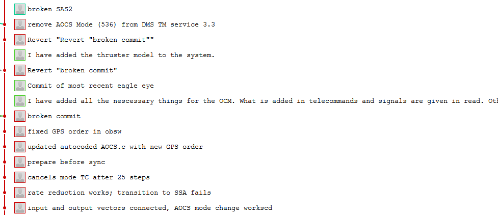
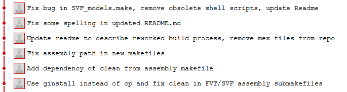

# Writing commit messages

## Bad commit messages

The following example show commit messages, how you can find them very often, if
certain standards for commit messages have not been followed:

## 7 git rules for better commit messages

*"[...] a commit message shows whether a developer is a good collaborator."
(Peter Hutterer)*

There are well established standards for writing readable commit messages

- **Separate subject from body with a blank line**  
  In some contexts, the first line is treated as the subject of an email and the
  rest of the text as the body.  The blank line separating the summary from the
  body is critical (unless you omit the body entirely); tools like rebase can
  get confused if you run the two together.
- **Use the imperative mood in the subject line**  
  "Fix bug" and not: Fixed bug" or "Fixes bug."  
  This convention matches up with commit messages generated by commands like git
  merge and git revert.
- **Limit the subject line to 50 (-72) characters**  
  GitHub’s UI is fully aware of these conventions. It will warn you if you go past the 50 character limit.
  And will truncate any subject line longer than 72 characters with an ellipsis.
- **Wrap the body at 72 (-80) characters**  
  The understanding is that you if you create a line break after 80 characters,
  the text becomes easier to review. Git never wraps text automatically. When
  you write the body of a commit message, you must mind its right margin, and
  wrap text manually. The recommendation is to do this at 72 characters, so that
  Git has plenty of room to indent text while still keeping everything under 80
  characters overall.  
  A good texteditor helps here!
- **Capitalize the subject line**
- **Do not end the subject line with a period**
- **Use the body to explain what and why vs. how**

Can you see a difference in the following screenshot (this is by the way the same repository)?

Sources:

- https://chris.beams.io/posts/git-commit
- https://www.freecodecamp.org/news/writing-good-commit-messages-a-practical-guide/